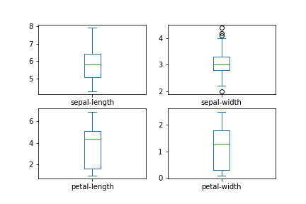
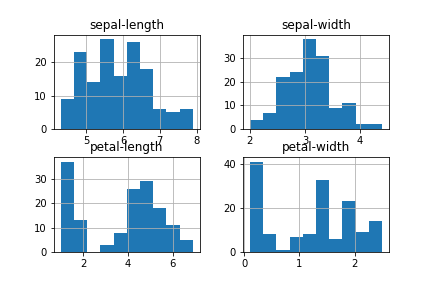
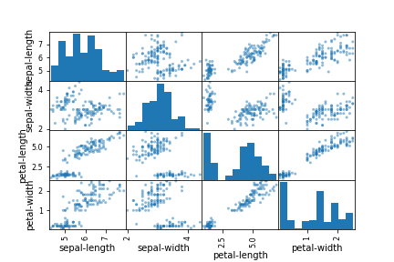
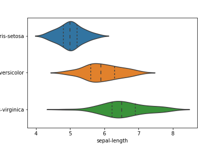
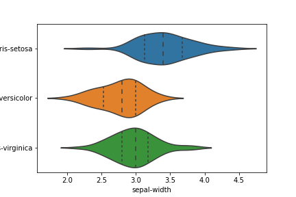
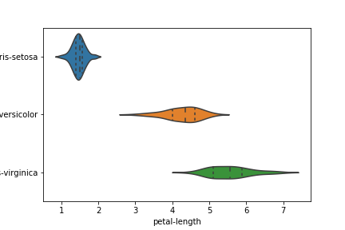
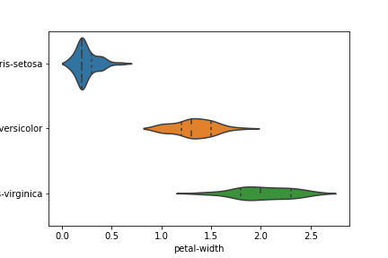
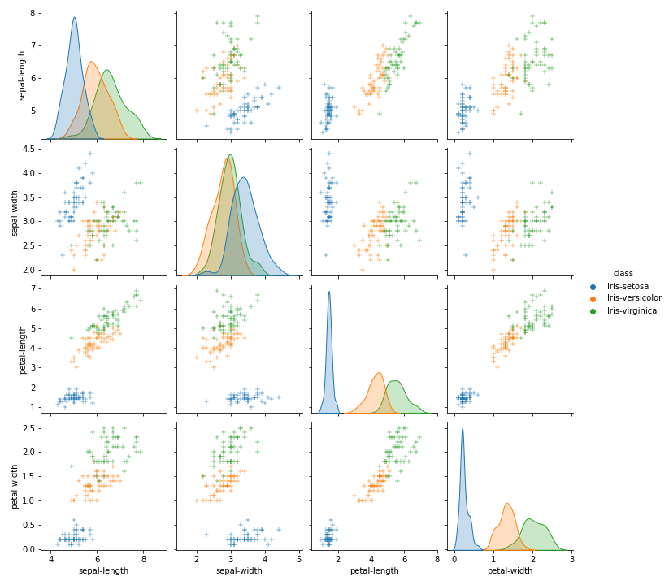
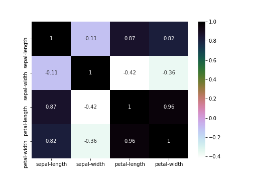
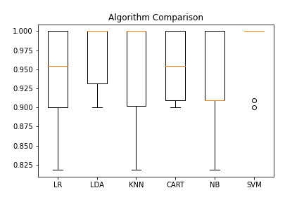

 

### Install

This project requires at least **Python 3.1** and the following Python libraries installed:

- [NumPy](http://www.numpy.org/)
- [Pandas](http://pandas.pydata.org)
- [Scikit-Learn](http://scikit-learn.org/stable/)
- [Matplotlib](http://matplotlib.org/users/installing.html/)
- [Seaborn](https://seaborn.pydata.org/installing.html/)

### Data

The dataset used in this project is included as `iris.csv`. This dataset is a freely available on the [UCI Machine Learning Repository](https://archive.ics.uci.edu/ml/datasets/). This dataset has the following attributes:

**Features**
1.  `Features`: sepal-length, sepal-width, petal-length, petal-width

**Target Variable**

4. `Target`: class

### Data Visualization

For univariate plot, a box and whisker plot and a histogram was plotted.

The preliminary results were obtained via plotting the dataset on Box and Whisker plot.

To obtain the frequency of the range of different features based on numerical data, a histogram was plotted and results were visualized in it.

Furthermore, to understand correlate the histogram with the data more, a scatter matrix was plotted.

Violin plot was used for checking the comparison of variable distribution between features

For multivariate plot, a pair plot was obtained to understand the best set of features to explain a relationship between two or more features so that choosing a Machine Learning Algorithm can become easier and data analysis can be satisfactory.

However, the problem faced was the visualization of the correlation numerics which was solved by plotting a heatmap.

### Algorithmic Evaluation

Before going on to this step, the `train_test_split()` was applied, resulting in the data being splitted into 70% for training and 30% for testing. So, in this project, the rule of thumb was 70-30.

This step was approached by testing the six types of Machine Learning Algorithms such as Logistic Regression (LR), Linear Discriminant Analysis (LDA), K-Nearest Neighbors (KNN), Classification and Regression Trees (CART), Gaussian Naive Bayes (NB) and Support Vector Machines (SVM).

The obtained evaluation data for the testing data were as follows by the 6 Machine Learning algorithms:
`LR: 0.934545 (0.071789)`
`LDA: 0.971818 (0.043112)`
`KNN: 0.952727 (0.062430)`
`CART: 0.953636 (0.046435)`
`NB: 0.935455 (0.058698)`
`SVM: 0.980909 (0.038236)`

To make things easier to understand, a box and whisker plot was constructed to get the big picture between performance of the six different algorithms.

### Evaluation of Predictions

After testing the model and measuring the accuracy score, the accuracy score was measured as `97.7%` or `98%` if rounded-off. 
However, the classification report measured the macro and micro average of precision, f1-score and recall to be `98%`.
